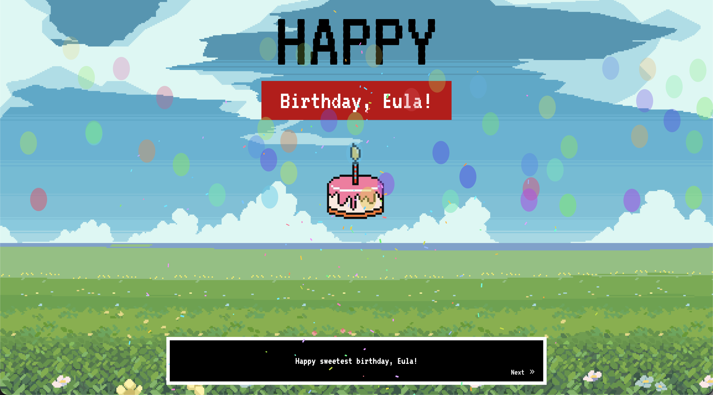

# Wholeheartedly 4 you

Is your dearest one on their birthday? And you're confused what to give in their special days.. You want to give something special, yet modern, yet uh, pixel?

Good things I made this Birthday Web called Wholeheartedly 4 you. It's really light and responsive. User can open this website in their phones or desktops (Please no smart watch). This website contains letter, some walkthrough dialogues and 9 photos of your dearest one.

Oh! And, submitted for [Sleepover!](https://sleepover.hackclub.com/)

## Web Preview



# So like.. how to use it?

Go through the files to change the contents you want. Including

```
portal.html
```

```
portal.js
```

```
dialogue.js
```

```
captcha.js
```

## Tech Stack

**Structure:** HTML5

**Styling:** TailwindCSS

**Script:** JavaScript

**Icon Library:** [remixicon](https://https://remixicon.com//)

## Some credits

- [confetti.js](https://confettijs.org/) for their amazing confetti.
- Some helpful guys from the [Stackoverflow](https://stackoverflow.com/) that helped me on the input box.

## Demo

Give it a try [here!](https://heywhatami.vercel.app/)

## Authors

Made with ❤️ by [@queenshafa](https://github.com/queenshafa/)
